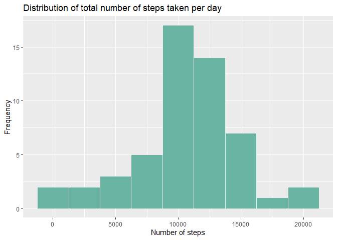
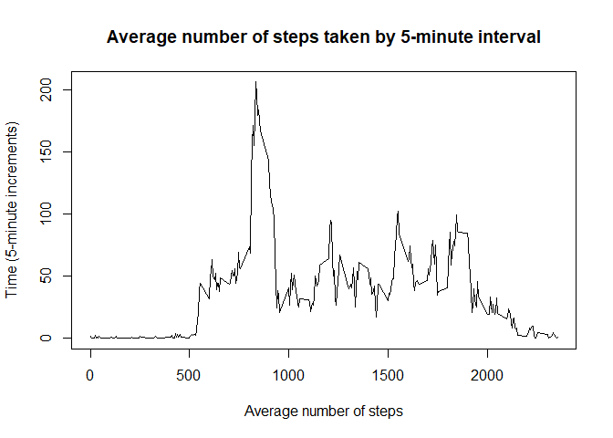
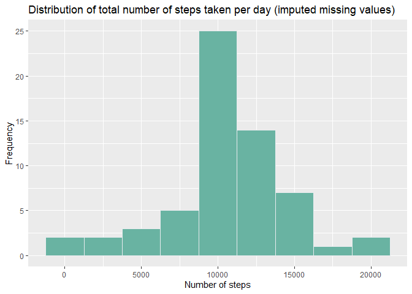
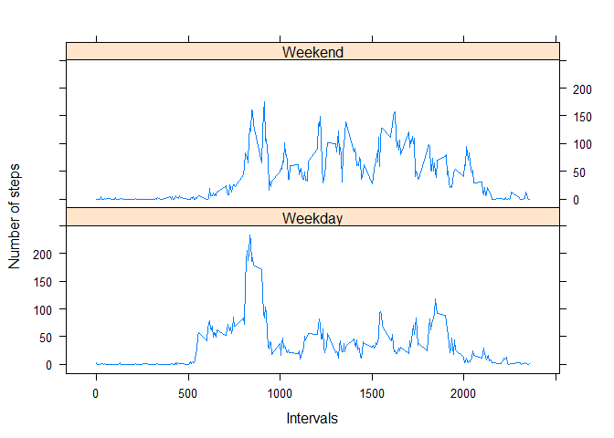

## Loading and preprocessing the data  
1. Load the data (i.e. read.csv())  
2. Process/transform the data (if necessary) into a format suitable for your analysis  


```r
#******************************************************************
#Step 0. Downloading dependencies
#******************************************************************
library(tidyverse)
library(readr)
library(lattice)

# 1. Download data in to data folder (git will ignore this folder)
if(!file.exists("./data")){dir.create("./data")}

if(!exists("activity")) {
  fileUrl<- "https://d396qusza40orc.cloudfront.net/repdata%2Fdata%2Factivity.zip"
  
  zipF <- "./data/activity_monitoring_data.zip"
  
  if(!file.exists(zipF)) {
    download.file(fileUrl, destfile = "./data/activity_monitoring_data.zip", method = "curl")
    outDir <- "./data"
    activity <- unzip(zipF, exdir = outDir)
  }
  
  # 2. Read data into global environment
  activity <- read.table("data/activity.csv", header = TRUE, sep = ",", dec = ".")
}

# 3. Format the date variable with as.Date
activity$date <- as.Date(activity$date, "%Y-%m-%d")
activity$weekday <- weekdays(activity$date)

summary(activity)
```

```
##      steps             date               interval        weekday         
##  Min.   :  0.00   Min.   :2012-10-01   Min.   :   0.0   Length:17568      
##  1st Qu.:  0.00   1st Qu.:2012-10-16   1st Qu.: 588.8   Class :character  
##  Median :  0.00   Median :2012-10-31   Median :1177.5   Mode  :character  
##  Mean   : 37.38   Mean   :2012-10-31   Mean   :1177.5                     
##  3rd Qu.: 12.00   3rd Qu.:2012-11-15   3rd Qu.:1766.2                     
##  Max.   :806.00   Max.   :2012-11-30   Max.   :2355.0                     
##  NA's   :2304
```


## What is mean total number of steps taken per day?  
1. Calculate the total number of steps taken per day
2. If you do not understand the difference between a histogram and a barplot, research the difference between them. Make a histogram of the total number of steps taken each day


```r
hist_data <- aggregate(steps ~ date, data = activity, sum, na.rm = TRUE)

hist <- ggplot(hist_data, aes(x=steps)) + 
  geom_histogram(fill="#69b3a2", color="#e9ecef", binwidth = 2500) +
    ggtitle("Distribution of total number of steps taken per day") +
  ylab("Frequency") + 
  xlab("Number of steps")

hist
```

<!-- -->

3. Calculate and report the mean and median of the total number of steps taken per day  

- The average number of steps taken per day: 

```r
mean <- mean(hist_data$steps)
mean
```

```
## [1] 10766.19
```

- The median number of steps taken per day: 


```r
median <- median(hist_data$steps)
median
```

```
## [1] 10765
```

## What is the average daily activity pattern?

1. Make a time series plot (i.e. type = "l") of the 5-minute interval (x-axis) and the average number of steps taken, averaged across all days (y-axis)  


```r
time_data <- aggregate(activity$steps, by=list(activity$interval), FUN=mean, na.rm=TRUE)
colnames(time_data) <- c("interval", "steps")

plot(time_data$interval, time_data$steps, type = "l", 
     main = "Average number of steps taken by 5-minute interval", 
              ylab = "Time (5-minute increments)", 
              xlab = "Average number of steps", 
              pch = 1)
```

<!-- -->

2. Which 5-minute interval, on average across all the days in the dataset, contains the maximum number of steps?

```r
time_data[which.max(time_data$steps), ]$interval
```

```
## [1] 835
```


## Imputing missing values  

1. Calculate and report the total number of missing values in the dataset (i.e. the total number of rows with NAs)


```r
summary <- summary(activity)
nas <- summary[7, 1]
nas <- str_split(nas, ":", simplify = TRUE)
nas <- as.numeric(nas[,2])
```
    - The only variable with missing values in the original dataset is 'steps'. Within 'steps' there are 2304 missing values. 

2. Devise a strategy for filling in all of the missing values in the dataset. The strategy does not need to be sophisticated. For example, you could use the mean/median for that day, or the mean for that 5-minute interval, etc.  

    - Strategy: If 'steps' is missing, fill that value with the mean for that 5-minute interval.  
    
3. Create a new dataset that is equal to the original dataset but with the missing data filled in.

```r
activity_impute <- activity

for (n in 1:nrow(activity_impute)) {
  if(is.na(activity_impute$steps[n])){
    time_data_row_n <- (n%%288)
    if (time_data_row_n == 0) {
      time_data_row_n <- 288
    }
    activity_impute$steps[n] <- time_data$steps[time_data_row_n]
  } 
}
```

4. Make a histogram of the total number of steps taken each day and Calculate and report the **mean** and **median** total number of steps taken per day. Do these values differ from the estimates from the first part of the assignment? What is the impact of imputing missing data on the estimates of the total daily number of steps?


```r
hist_data_impute <- aggregate(steps ~ date, data = activity_impute, sum, na.rm = TRUE)

hist_impute <- ggplot(hist_data_impute, aes(x=steps)) + 
  geom_histogram(fill="#69b3a2", color="#e9ecef", binwidth = 2500) +
    ggtitle("Distribution of total number of steps taken per day (imputed missing values)") +
  ylab("Frequency") + 
  xlab("Number of steps")

hist_impute
```

<!-- -->

- The average number of steps taken per day with imputed data: 


```r
mean_imp <- mean(hist_data_impute$steps)
mean_imp
```

```
## [1] 10766.19
```

- The median number of steps taken per day with imputed data: 


```r
median_imp <- median(hist_data_impute$steps)
median_imp
```

```
## [1] 10766.19
```

## Are there differences in activity patterns between weekdays and weekends?  

1. Create a new factor variable in the dataset with two levels – “weekday” and “weekend” indicating whether a given date is a weekday or weekend day.


```r
activity_weekdays <- activity
weekdays <- c("Friday" ,   "Monday", "Thursday", "Tuesday", "Wednesday" )

activity_weekdays$weekend <- c('Weekend', 'Weekday')[(weekdays(activity_weekdays$date) %in% weekdays)+1L]

time_data_weekday <- aggregate(activity_weekdays$steps, by=list(activity_weekdays$interval, 
                                                                activity_weekdays$weekend), FUN=mean, na.rm=TRUE)
colnames(time_data_weekday) <- c("interval", "weekday", "steps")
```

2. Make a panel plot containing a time series plot type = "l") of the 5-minute interval (x-axis) and the average number of steps taken, averaged across all weekday days or weekend days (y-axis). See the README file in the GitHub repository to see an example of what this plot should look like using simulated data.


```r
xyplot(steps ~ interval | weekday, data = time_data_weekday,
      panel = function(x, y, ...){panel.xyplot(x, y, ...)},
      type="l",
      xlab="Intervals",
      ylab="Number of steps",
      layout=c(1,2)
      )
```

<!-- -->

